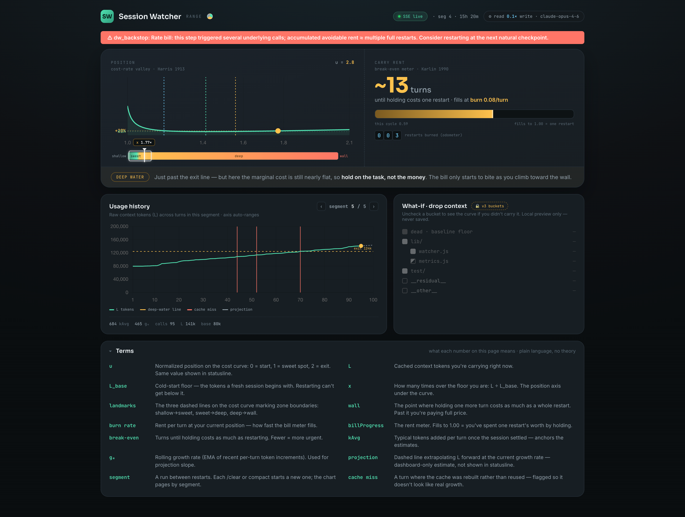
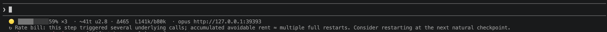

<div align="center">

# Session Watcher

**LLM context economics, in your terminal.**

Session Watcher treats your prompt cache as *inventory* — it uses EOQ theory to tell you whether the current context is still *worth carrying*, and when to restart. Works with any session-based coding agent.



</div>

<p align="center">
  <a href="https://doi.org/10.5281/zenodo.21236704"></a>
  <a href="LICENSE"></a>
  <a href="#install"></a>
</p>

<p align="center">
  <a href="#install">Install</a> ·
  <a href="#quick-start">Quick Start</a> ·
  <a href="#how-it-works">How It Works</a> ·
  <a href="#mcp-tools">MCP Tools</a> ·
  <a href="#agent-support">Agents</a> ·
  <a href="#paper">Paper</a> ·
  <a href="#citation">Cite</a>
</p>

---

## What it does

Session Watcher monitors your agent's session transcript in real time and answers one question: **should I restart this session?**

- **Real-time dashboard** — Chart.js SPA with SSE streaming: token stock `L`, exit line `L*`, per-turn cost, bill progress, rate-lamp interrupt meter
- **Statusline widget** — one-line shell command for your terminal status bar: lamp · progress bar · turn counter · cost rate · `L/b` · model
- **Zero context pollution** — the MCP tools return only a URL. No metric number, no transcript content, no session state ever re-enters the model's context
- **Fully local** — all state lives in a sidecar JSON file; no cloud, no telemetry, no API calls

## How it works

```
Your coding agent (Claude Code, OpenCode, OpenClaw, etc.)
        │  writes session transcripts
        ▼
┌──────────────────────────────────────────┐
│  Session Watcher (local sidecar daemon)   │
│  ─────────────────────────────────────── │
│  fold.js     — tail JSONL, fold usage    │
│  baseline.js — detect cold-start L_base  │
│  metrics.js  — compute L* (EOQ-optimal)  │
│  rate-lamp.js — interrupt meter (burn)   │
│  server.js   — Express + SSE dashboard   │
│  statusline.sh — one-line shell client   │
└──────────────────────────────────────────┘
        │  dashboard :31393  ·  statusline  ·  MCP
        ▼
   Your browser / terminal status bar
```

**Core model:** `L = cache_read_input_tokens` (your context stock, rent-free while cached). When `L` crosses the EOQ-optimal restart line `L*`, the dashboard and statusline signal restart. See the [paper](#paper) for the full derivation — EOQ inventory theory mapped to LLM prompt caching.

## Install

### Plugin (recommended)

```bash
# 1. Add the marketplace (one-time)
claude plugin marketplace add nomadop/session-watcher

# 2. Install the plugin
claude plugin install session-watcher@session-watcher
```

Or from within a Claude Code session:
```
/plugin marketplace add nomadop/session-watcher
/plugin install session-watcher@session-watcher
/reload-plugins
```

This registers:
- **MCP tools** (`start_watcher`, `stop_watcher`, `watcher_status`) — available in every session
- **SessionStart hook** — auto-launches the dashboard server on each session
- **Stop hook** — evaluates the restart gate on each stop boundary

If you installed or updated in an already-running session, run `/reload-plugins` to activate.

### Manual MCP

```json
{
  "mcpServers": {
    "session-watcher": { "command": "node", "args": ["/path/to/index.js"] }
  }
}
```

Add to your project's `.mcp.json` or `~/.claude/settings.json`. Then call `start_watcher` — it launches the dashboard and returns its URL.

### Auto-launch with every session

```json
{
  "hooks": { "SessionStart": [{ "command": "<path>/hooks/session-start.js" }] }
}
```

Add to `~/.claude/settings.json`. The watcher starts automatically, fire-and-forget.

### Statusline

The plugin system does not yet support declaring a statusline. Add to your `~/.claude/settings.json`:

```json
{
  "statusLine": {
    "type": "command",
    "command": "<plugin-install-path>/dist/statusline.sh"
  }
}
```

Find your plugin path with:
```bash
find ~/.claude/plugins/cache -path '*/session-watcher/*/dist/statusline.sh' -print
```

Or check via `claude plugin details session-watcher@session-watcher`.

**Note:** the plugin cache path changes on version update. After updating, re-run the command above and update your statusline path.

One compact line:



## Quick Start

```bash
git clone https://github.com/nomadop/session-watcher.git
cd session-watcher
npm install
node server.js --project ~/.claude/projects/<project> --open
```

Additional flags: `--ratio <N>` (override C_RATIO), `--port <N>` (fixed port), `--lbase <N>` (override baseline — only when transcript has no cold start).

Then open `http://localhost:31393` in your browser. The dashboard updates in real time as your agent runs.

## MCP tools

| Tool | Description |
|------|-------------|
| `start_watcher` | Start (or reuse) the dashboard server; returns its URL |
| `stop_watcher` | Stop the managed server |
| `watcher_status` | Report whether the server is running and its URL |

All three are read-only — they never return metric values or session content into the model's context.

## Agent support

Session Watcher is agent-agnostic. The measurement pipeline (fold, baseline, `L*`, rate-lamp) only needs `cache_read_input_tokens` from each turn — it doesn't care which agent produced the transcript.

| Agent | Driver | Status |
|-------|--------|--------|
| Claude Code | JSONL tail (native) | ✅ |
| OpenCode | adapter-ready | pending |
| OpenClaw | adapter-ready | pending |
| Hermes | adapter-ready | pending |
| Aider | adapter-ready | pending |

Adding a new agent requires implementing one interface: extract `cache_read_input_tokens` from the agent's session transcript. See [`lib/extract.js`](lib/extract.js) for the Claude Code reference driver. PRs welcome.

## Paper

> **Context Is Inventory: A Rent-or-Buy Model for Prompt-Cached LLM Sessions**
> Longju Cheng (2026) · DOI: [`10.5281/zenodo.21236704`](https://doi.org/10.5281/zenodo.21236704)

The paper derives the full theoretical specification: EOQ→LLM mapping, the 41.4% movable-cost bound, the ski-rental restart strategy, and measurements on 1,016 real session transcripts. See [`paper/paper.pdf`](paper/paper.pdf).

The current release implements the full paper specification: the measurement pipeline (fold, baseline, `L*`, `φ`), the billing gauge (`billProgress`), the rate-lamp interrupt meter with wall-position scaling, model-tier-specific pricing ratios, deep-water latching, and the restart recommendation signal via dashboard and statusline.

## Uninstall

```bash
claude plugin uninstall session-watcher@session-watcher
# Remove state directory (optional):
rm -rf ~/.session-watcher
```

## Test

```bash
npm test              # unit + integration (node:test)
npx playwright test   # E2E (requires running server)
```

## Citation

```bibtex
@unpublished{cheng2026context,
  author = {Longju Cheng},
  title  = {Context Is Inventory: A Rent-or-Buy Model for Prompt-Cached LLM Sessions},
  year   = 2026,
  doi    = {10.5281/zenodo.21236704},
  url    = {https://doi.org/10.5281/zenodo.21236704},
  note   = {Preprint}
}
```

## License

MIT
