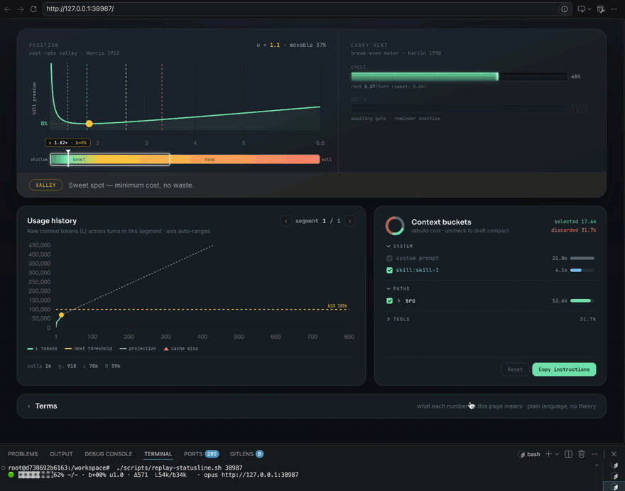
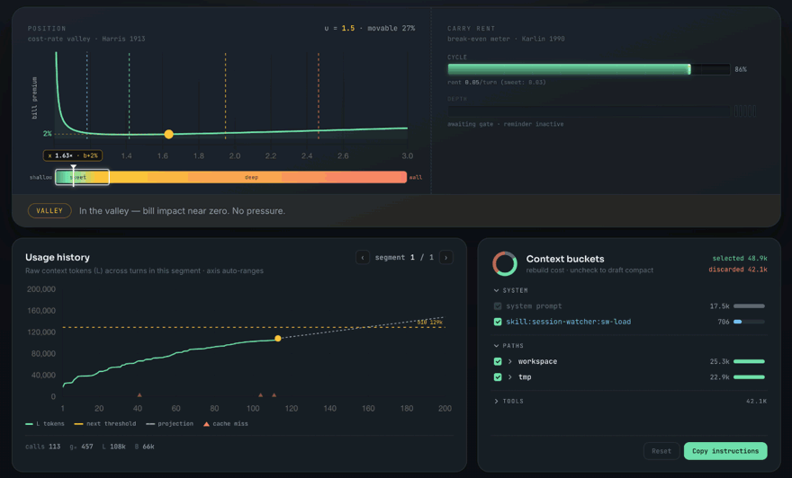
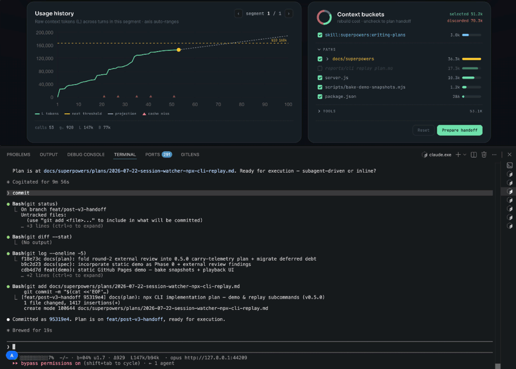

<div align="center">

# Session Watcher

**LLM context economics, in your terminal.**

Session Watcher treats your prompt cache as *inventory* — it uses EOQ theory to tell you whether the current context is still *worth carrying*, and when to restart. Works with any session-based coding agent.



</div>

<p align="center">
  <a href="https://doi.org/10.5281/zenodo.21236704"></a>
  <a href="LICENSE"></a>
  <a href="#install"></a>
</p>

<p align="center">
  <a href="#quick-start">Quick Start</a> ·
  <a href="#install">Install</a> ·
  <a href="#how-it-works">How It Works</a> ·
  <a href="#context-buckets">Context Buckets</a> ·
  <a href="#handoff">Handoff</a> ·
  <a href="#mcp-tools">MCP Tools</a> ·
  <a href="#agent-support">Agents</a> ·
  <a href="#paper">Paper</a> ·
  <a href="#citation">Cite</a>
</p>

---

## What it does

Session Watcher reads your Claude Code transcript in real time and answers one question: **is this session still worth carrying?**

Most context tools optimize *how* you consume tokens — Headroom compresses, `/compact` shrinks, RTK filters. Session Watcher answers *when* to restart. They compose: run any pruning strategy you like, SW tells you when it's time to `/clear`.

SW reads from the transcript, never writes to it. The dashboard and statusline are pure observers; MCP tools return data for you to act on. Metrics stay on your screen, not in the model's context window.

## How it works

```
Your coding agent (Claude Code)
        │  writes session transcript
        ▼
┌──────────────────────────────────────────┐
│  Session Watcher (in-process MCP server)  │
│  ─────────────────────────────────────── │
│  fold.js     — tail JSONL, fold usage    │
│  measure.js  — B (context belief)        │
│  rate-lamp   — bill premium (br) + gate  │
│  server.js   — Express + SSE dashboard   │
│  statusline  — one-line shell client     │
└──────────────────────────────────────────┘
        │  dashboard  ·  statusline  ·  MCP
        ▼
   Your browser / terminal status bar
```

**Core model:** `B = cache_read_input_tokens` (your context inventory). `g = ΔL − ΔB` (growth gap). `x = L / B` (position on the EOQ cost curve). `br = mf × pp` (bill premium — the percentage you're overpaying relative to optimal).

Three thresholds: green valley (br < 10%), amber attention (10–15%), red restart (≥ 25%). See the [paper](#paper) for the full derivation — EOQ inventory theory mapped to LLM prompt caching.

## Quick Start

```bash
# Try without installing — self-contained demo
npx @nomadop/session-watcher demo

# Replay your own transcript
npx @nomadop/session-watcher replay ~/.claude/projects/<project>/<session>.jsonl
```

Opens a browser dashboard. The demo uses a pre-built anonymized session; replay uses your real transcript. Both are read-only — nothing is modified or uploaded.

## Install

### Plugin (recommended)

```bash
# 1. Add the marketplace (one-time)
claude plugin marketplace add nomadop/session-watcher

# 2. Install the plugin
claude plugin install session-watcher@session-watcher
```

Or from within a Claude Code session:
```
/plugin marketplace add nomadop/session-watcher
/plugin install session-watcher@session-watcher
/reload-plugins
```

This registers:
- **MCP tools** — available in every session
- **SessionStart hook** — auto-launches the dashboard server on each session

If you installed or updated in an already-running session, run `/reload-plugins` to activate.

## Statusline

The plugin system does not yet support declaring a statusline. Add to your `~/.claude/settings.json`:

```json
{
  "statusLine": {
    "type": "command",
    "command": "<plugin-install-path>/dist/statusline.js"
  }
}
```

Find your plugin path with:
```bash
find ~/.claude/plugins/cache -path '*/session-watcher/*/dist/statusline.js' -print
```

Or check via `claude plugin details session-watcher@session-watcher`.

**Note:** the plugin cache path changes on version update. After updating, re-run the command above and update your statusline path.

One compact line:


## Context Buckets

The bucket panel shows exactly which files, skills, and tools are consuming your context budget. Each path carries a token count — check or uncheck to preview how the restart cost changes. The U-curve ghost line updates in real time as you toggle.



## Handoff

When it's time to restart, handoff preserves the state you want to keep. Run `/sw-handoff` to prepare a package — selected paths, working summary, next task. Then `/clear`, and in the fresh session run `/sw-load` to restore. Only what you chose is rebuilt — less ramp-up, less waste.



## MCP Tools

**Server lifecycle**

| Tool | Description |
|------|-------------|
| `start_watcher` | Start (or reuse) the dashboard server; returns its URL |
| `stop_watcher` | Stop the managed server |
| `watcher_status` | Report whether the server is running and its URL |
| `rotate_session` | Rotate to a new session ID |

**Handoff workflow**

| Tool | Description |
|------|-------------|
| `get_bucket_summary` | Return current context bucket structure (files, skills, tools) with metrics |
| `prepare_handoff` | Persist selected paths + summary as a handoff package; returns a semantic token |
| `load_handoff` | Load a handoff by token, free-text search, or auto-match for the current project |

Tools return data for you to decide on — only handoff injects context back into the model, and only the paths you explicitly selected.

## Agent support

Session Watcher is agent-agnostic. The measurement pipeline only needs `cache_read_input_tokens` from each turn — it doesn't care which agent produced the transcript.

| Agent | Driver | Status |
|-------|--------|--------|
| Claude Code | JSONL tail (native) | ✅ |
| OpenCode | adapter-ready | pending |
| OpenClaw | adapter-ready | pending |
| Hermes | adapter-ready | pending |
| Aider | adapter-ready | pending |

Adding a new agent requires implementing one interface: extract `cache_read_input_tokens` from the agent's session transcript. See [`lib/extract.js`](lib/extract.js) for the Claude Code reference driver. PRs welcome.

## Paper

> **Context Is Inventory: A Rent-or-Buy Model for Prompt-Cached LLM Sessions**
> Longju Cheng (2026) · DOI: [`10.5281/zenodo.21236704`](https://doi.org/10.5281/zenodo.21236704)

The paper derives the full theoretical specification: EOQ→LLM mapping, the 41.4% movable-cost bound, the ski-rental restart strategy, and measurements on 1,016 real session transcripts. See [`paper/paper.pdf`](paper/paper.pdf).

## Uninstall

```bash
claude plugin uninstall session-watcher@session-watcher
# Remove state directory (optional):
rm -rf ~/.session-watcher
```

## Test

```bash
npm test              # unit + integration (node:test)
npx playwright test   # E2E (requires running server)
```

## Citation

```bibtex
@unpublished{cheng2026context,
  author = {Longju Cheng},
  title  = {Context Is Inventory: A Rent-or-Buy Model for Prompt-Cached LLM Sessions},
  year   = 2026,
  doi    = {10.5281/zenodo.21236704},
  url    = {https://doi.org/10.5281/zenodo.21236704},
  note   = {Preprint}
}
```

## License

MIT
