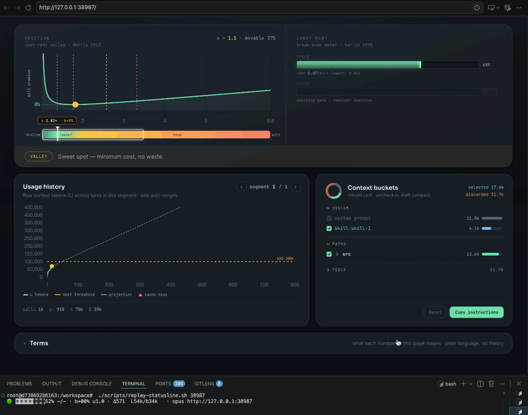
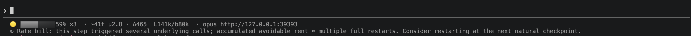
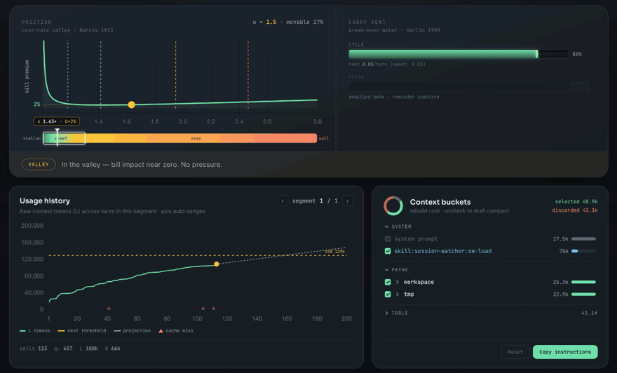
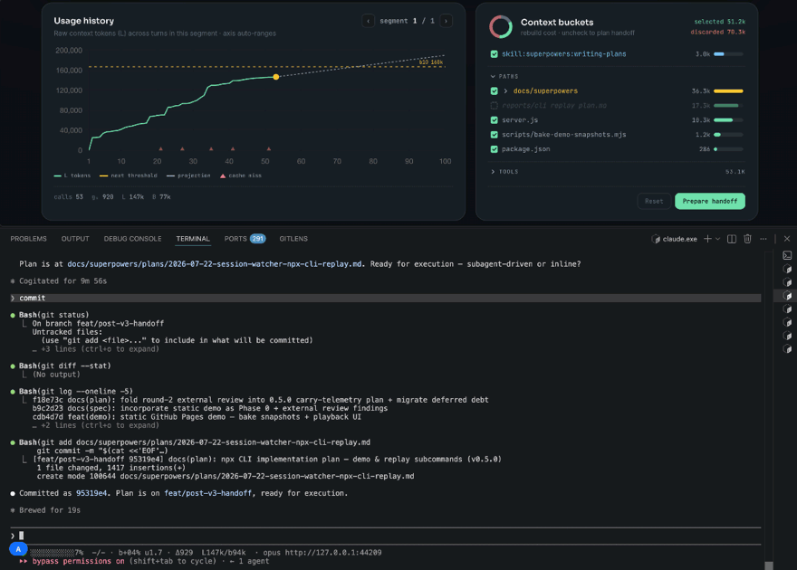

<div align="center">

# Session Watcher

**LLM context economics, in your terminal.**

Session Watcher treats your prompt cache as *inventory* — it uses EOQ theory to measure whether the current context is still *worth carrying*, tracking restart pressure so you can decide when to hand off.



</div>

<p align="center">
  <a href="https://doi.org/10.5281/zenodo.21236704"></a>
  <a href="LICENSE"></a>
  <a href="#install"></a>
</p>

<p align="center">
  <a href="https://nomadop.github.io/session-watcher/docs/"><strong>Documentation</strong></a> ·
  <a href="https://www.npmjs.com/package/@nomadop/session-watcher">npm</a> ·
  <a href="https://doi.org/10.5281/zenodo.21236704">Paper</a> ·
  <a href="llms.txt">llms.txt</a>
</p>

<p align="center">
  <a href="#quick-start">Quick Start</a> ·
  <a href="#install">Install</a> ·
  <a href="#how-it-works">How It Works</a> ·
  <a href="#context-buckets">Context Buckets</a> ·
  <a href="#handoff">Handoff</a> ·
  <a href="#mcp-tools">MCP Tools</a> ·
  <a href="#agent-support">Agents</a> ·
  <a href="#citation">Cite</a>
</p>

---

## What it does

Session Watcher reads your Claude Code transcript in real time and answers one question: **is this session still worth carrying?**

Most context tools optimize *how* you consume tokens — Headroom compresses, `/compact` shrinks, RTK filters. Session Watcher tracks *when* the cost curve is drifting, giving you the data to decide. They compose: run any pruning strategy you like, SW measures the cost curve so you can decide when to hand off.

SW reads from the transcript, never writes to it. The dashboard and statusline are pure observers; MCP tools return data for you to act on. Metrics stay on your screen, not in the model's context window.

## How it works

```
Your coding agent (Claude Code)
        │  writes session transcript
        ▼
┌───────────────────────────────────────────────────────┐
│  Session Watcher (in-process MCP server)              │
│  ───────────────────────────────────────────────────  │
│  harness/claude-code  — read rows, emit observations  │
│  measurement/engine   — B (context belief), epochs    │
│  session-watcher      — apply frames, run operations  │
│  rate-lamp            — rent ledger + wallet clock    │
│  server.js            — Express + SSE dashboard       │
│  statusline           — one-line shell client         │
└───────────────────────────────────────────────────────┘
        │  dashboard  ·  statusline  ·  MCP
        ▼
   Your browser / terminal status bar
```

The harness layer is the only part that knows Claude Code: it reads transcript rows, decides the active branch, and emits normalized observations. Everything below it — measurement, dialogue history, handoff — consumes those observations and carries no transcript format, no row shape, and no tool name of any particular agent.

**Core model:** `L = cache_read_input_tokens` — the context stock you are renting. `B` is the rebuild baseline: the session's overhead floor plus the tokens of every file, skill and tool it has pulled in, which is what a restart would have to re-read. `g` is the growth no path accounts for, a smoothed `ΔtotalStock − ΔB`. `x = L / B` is the raw position ratio; the authoritative position is `u`, which every call advances by its own fraction of the restart interval that held while it ran, so the position records the path travelled rather than a ratio of today's numbers, and each landmark on the x axis is read off the reference skeleton fitted across that path. `br = mf × pp` is the bill premium — how much you are overpaying relative to ideal restart timing. The restart reminder is separate: it reads the rent the ledger has accumulated, so no revision of the position can withdraw one.

Lamp thresholds are the named constants `BR_AMBER` and `BR_RED` in `lib/bill-regret.js`: below the amber one the lamp is green, between them amber, at or above the red one red. See the [paper](#paper) for the full derivation — EOQ inventory theory mapped to LLM prompt caching.

## Quick Start

Requires Node.js ≥ 22.16.

```bash
# Try without installing — self-contained demo
npx -y @nomadop/session-watcher demo

# Replay your own transcript
npx -y @nomadop/session-watcher replay ~/.claude/projects/<project>/<session>.jsonl
```

Opens a browser dashboard. The demo uses a pre-built anonymized session; replay uses your real transcript. Both are read-only — nothing is modified or uploaded.

## Install

### Plugin (recommended)

```bash
# 1. Add the marketplace (one-time)
claude plugin marketplace add nomadop/session-watcher

# 2. Install the plugin
claude plugin install session-watcher@session-watcher
```

Or from within a Claude Code session:
```
/plugin marketplace add nomadop/session-watcher
/plugin install session-watcher@session-watcher
/reload-plugins
```

This registers:
- **MCP tools** — available in every session
- **SessionStart hook** — auto-launches the dashboard server on each session

If you installed or updated in an already-running session, run `/reload-plugins` to activate.

## Statusline

The plugin system does not yet support declaring a statusline. Add to your `~/.claude/settings.json`:

```json
{
  "statusLine": {
    "type": "command",
    "command": "<plugin-install-path>/dist/statusline.js"
  }
}
```

Find your plugin path with:
```bash
find ~/.claude/plugins/cache -path '*/session-watcher/*/dist/statusline.js' -print
```

Or check via `claude plugin details session-watcher@session-watcher`.

**Note:** the plugin cache path changes on version update. After updating, re-run the command above and update your statusline path.

One compact line:



## Context Buckets

The bucket panel shows exactly which files, skills, and tools are consuming your context budget. Each path carries a token count — check or uncheck to preview how the restart cost changes. The U-curve ghost line updates in real time as you toggle.



## Handoff

When it's time to restart, handoff preserves the state you want to keep. Run `/sw-handoff` to prepare a package — selected paths, working summary, next task. Then `/clear`, and in the fresh session run `/sw-load` to restore. Only what you chose is rebuilt — less ramp-up, less waste.



## MCP Tools

**Server lifecycle**

| Tool | Description |
|------|-------------|
| `start_watcher` | Start (or reuse) the dashboard server; returns its URL |
| `stop_watcher` | Stop the managed server |
| `watcher_status` | Report whether the server is running and its URL |
| `rotate_session` | Rotate to a new session ID |

**Handoff workflow**

| Tool | Description |
|------|-------------|
| `get_bucket_summary` | Return current context bucket structure (files, skills, tools) with metrics |
| `get_turn_skeleton` | Render the turns of the capture epoch, one block per turn, as the slots a note can fill |
| `submit_turn_notes` | Return the producing session's notes through the slots the skeleton defines |
| `prepare_handoff` | Persist selected paths + summary as a handoff package; returns a semantic token |
| `load_handoff` | Load a handoff by token, free-text search, or auto-match for the current project |

**Turn history**

Read the history turns carried by the handoff loaded into the current session. All three resolve that lineage themselves and take no lineage identifier — without a loaded handoff there is nothing to read.

| Tool | Description |
|------|-------------|
| `turn_page` | Page deeper into the history, newest first; a returned cursor proves more history remains, while its absence does not prove none does |
| `turn_search` | Find a literal that occurs verbatim in the transcripts — an identifier, a path, a quoted phrase |
| `turn_locate` | Find which turn ranges mention a remembered term, when the original wording is unknown |

Tools return data for you to decide on — only handoff injects context back into the model, and only the paths you explicitly selected.

## Agent support

Session Watcher is agent-agnostic. Everything below the harness layer consumes normalized observations, so it never learns which agent produced the session.

| Agent | Driver | Status |
|-------|--------|--------|
| Claude Code | JSONL tail (native) | ✅ |
| OpenCode | adapter-ready | pending |
| OpenClaw | adapter-ready | pending |
| Hermes | adapter-ready | pending |
| Aider | adapter-ready | pending |

Adding a new agent means writing a harness for it: a source driver that turns that agent's own session evidence into normalized observations, and a projection that maps those observations onto measurement records. The engine, dialogue history, handoff, and every product surface are shared and need no change. See [`lib/harness/claude-code/`](lib/harness/claude-code/) for the reference harness — [`source-driver.js`](lib/harness/claude-code/source-driver.js) and [`measurement-projection.js`](lib/harness/claude-code/measurement-projection.js) are the two pieces a new agent supplies. PRs welcome.

## Paper

> **Context Is Inventory: A Rent-or-Buy Model for Prompt-Cached LLM Sessions**
> Longju Cheng (2026) · DOI: [`10.5281/zenodo.21236704`](https://doi.org/10.5281/zenodo.21236704)

The paper derives the full theoretical specification: EOQ→LLM mapping, the 41.4% movable-cost bound, the ski-rental restart strategy, and measurements on 1,016 real session transcripts. Read it at the [DOI](https://doi.org/10.5281/zenodo.21236704) above.

## Uninstall

```bash
claude plugin uninstall session-watcher@session-watcher
# Remove state directory (optional):
rm -rf ~/.session-watcher
```

## Test

```bash
npm test              # unit + integration (node:test)
npx playwright test   # E2E (requires running server)
```

## Citation

```bibtex
@unpublished{cheng2026context,
  author = {Longju Cheng},
  title  = {Context Is Inventory: A Rent-or-Buy Model for Prompt-Cached LLM Sessions},
  year   = 2026,
  doi    = {10.5281/zenodo.21236704},
  url    = {https://doi.org/10.5281/zenodo.21236704},
  note   = {Preprint}
}
```

## Privacy

- No remote telemetry.
- Transcripts are read locally and never uploaded.
- Local aggregate usage and handoff records are stored under `~/.session-watcher`.
- No transcript prose or file contents are stored in telemetry.
- Removing `~/.session-watcher` deletes all local state.

## License

MIT
